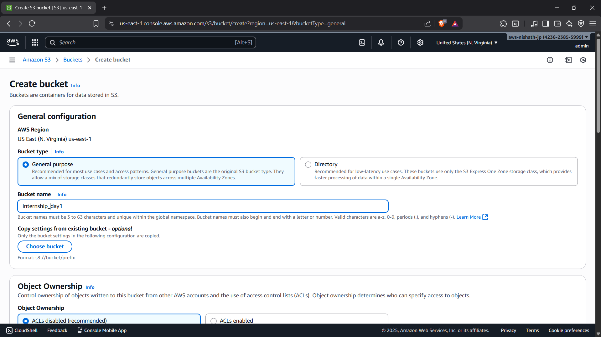
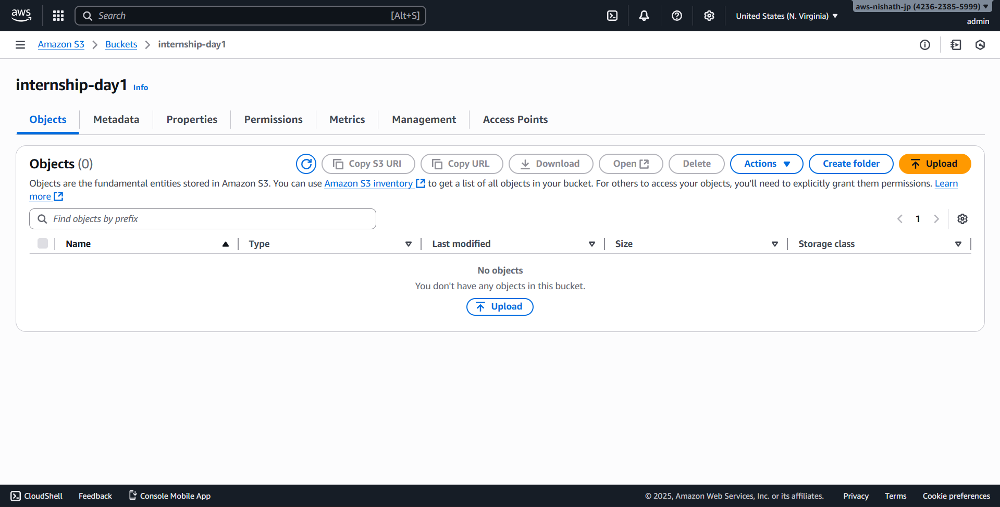
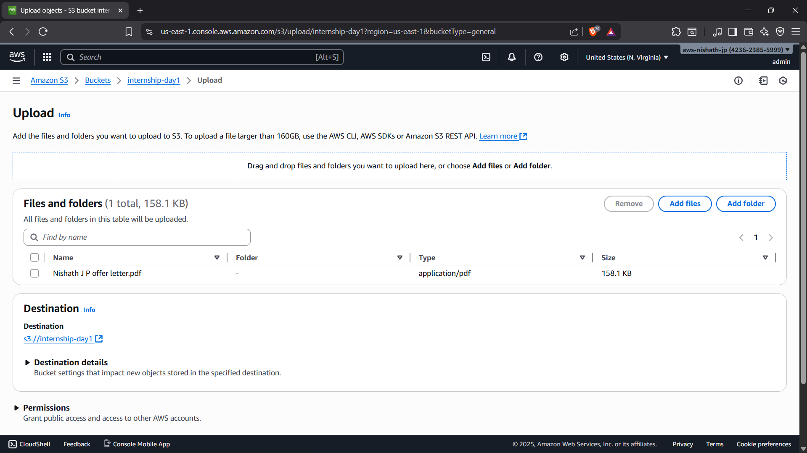
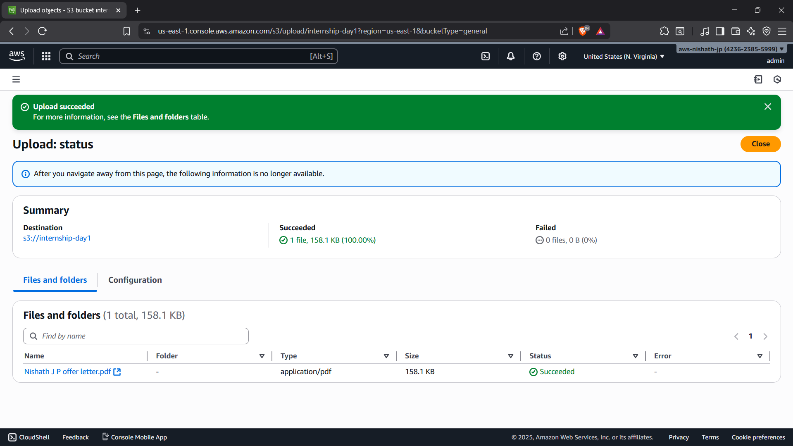
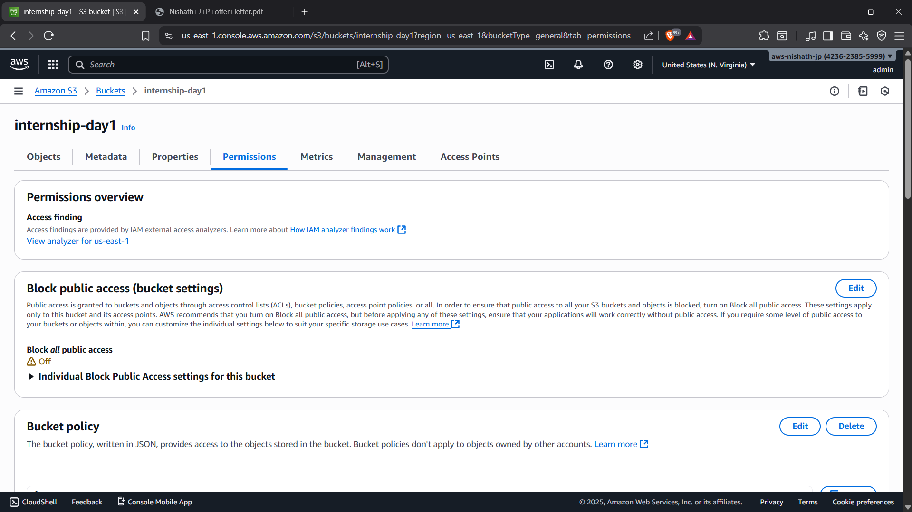
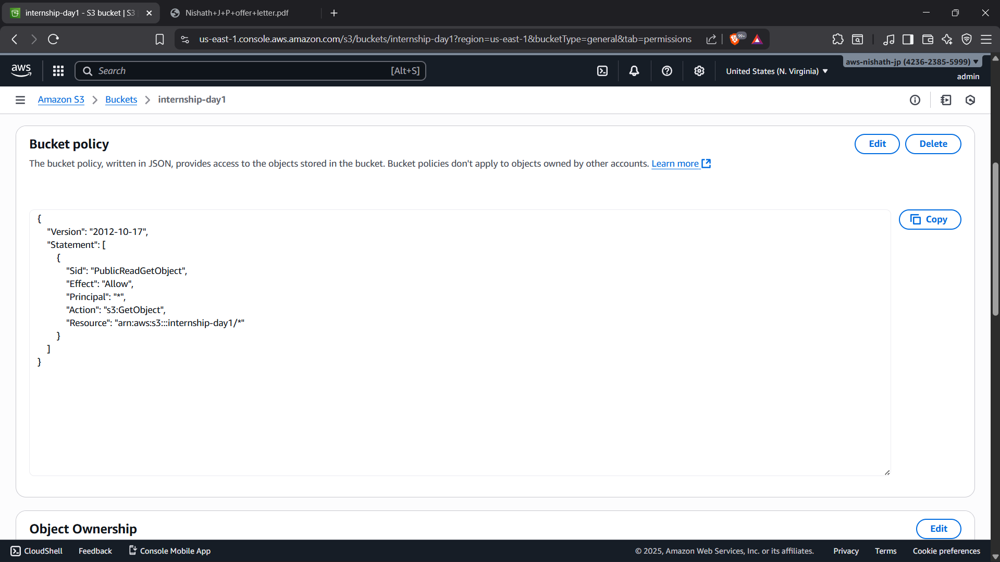
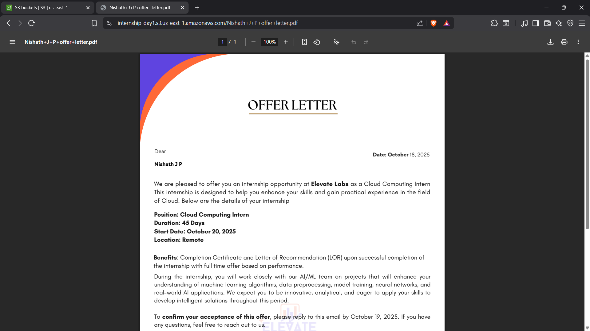

# Day 1 - Cloud Internship ElevateLabs

This is a documentation from Day 1 of my internship.

## Task

Objective: Understand cloud object storage basics.
Tools: Google Cloud Storage (Free Tier) or AWS S3 (Free Tier).

## What I Did 

- Created a New AWS user named admin from my root account's IAM.
- Created a New General S3 bucket named internship-day 1.

- Then uploaded a document in the bucket.

- To make the bucket public I removed Block all public access option and add a new policy to the bucket.

- After that the object's in the bucket become publicly accessible.

- [Click here to view the object](https://internship-day1.s3.us-east-1.amazonaws.com/Nishath+J+P+offer+letter.pdf)