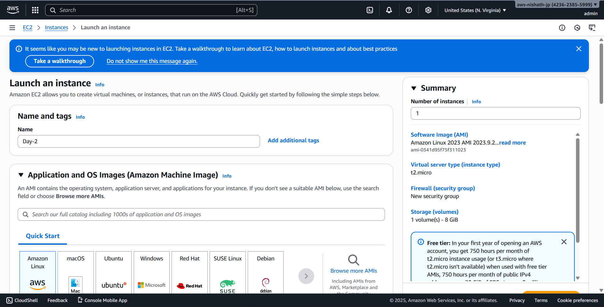
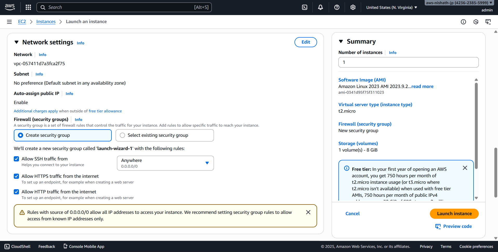
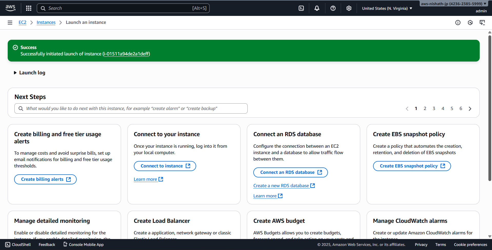
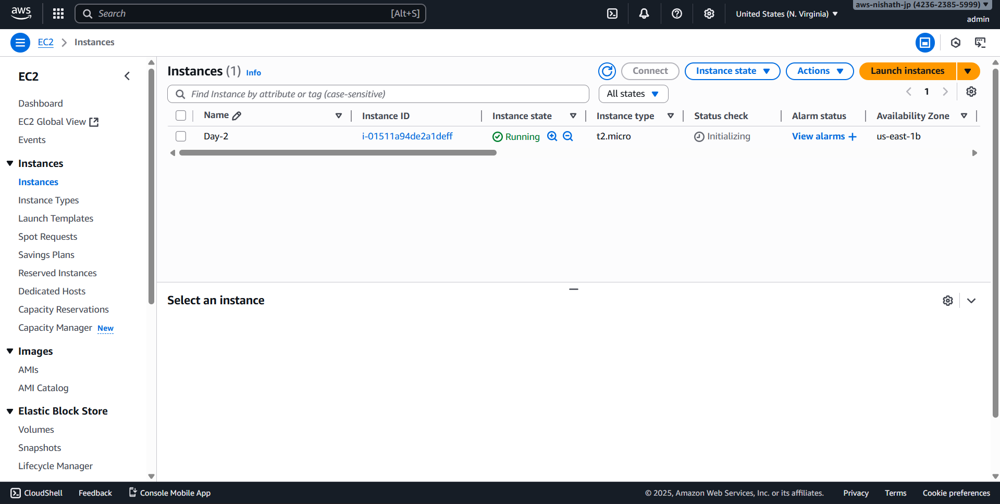
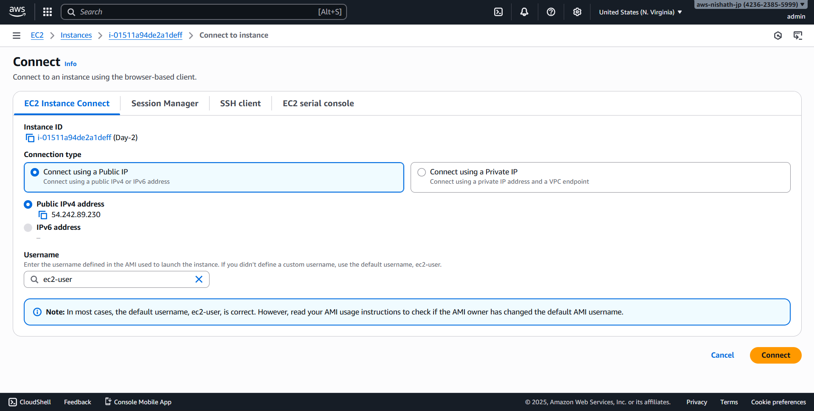
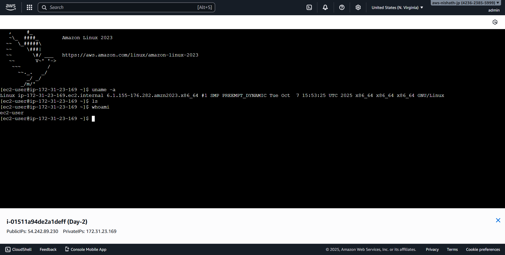

# Day 2 - Cloud Internship ElevateLabs

This is a documentation from Day 2 of my internship.

## Task

☁ *Task 2: Launch a Virtual Machine (VM) Instance*

---

🎯 Objective:

To understand *how cloud virtual machines work* by creating, configuring, and connecting to a *cloud-based server instance* using a free-tier account.
This task introduces interns to *Infrastructure-as-a-Service (IaaS)* — the foundation of all cloud operations.


## What I Did 

- I launched a EC2 instance named Day-2
- In the region : us-east-1
- With t2-micro instance type.
- Configured the firewall to allow https and http traffic through.












- Used AWS intance connect to ssh into the Ec2 instance 
**And executed the commends**
```Bash
  uname -a
  ls
  whoami





