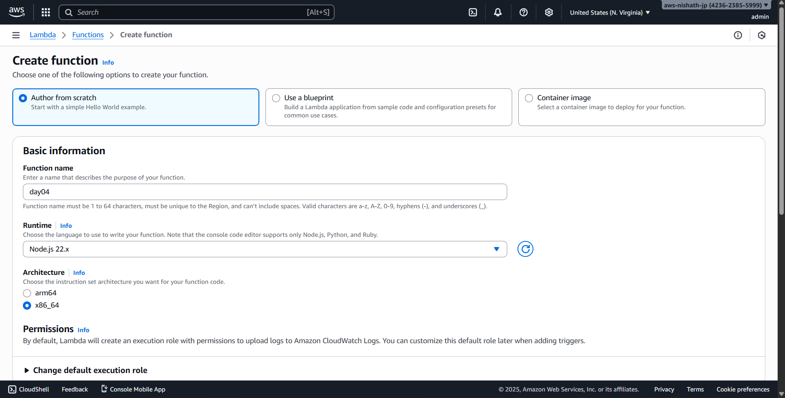
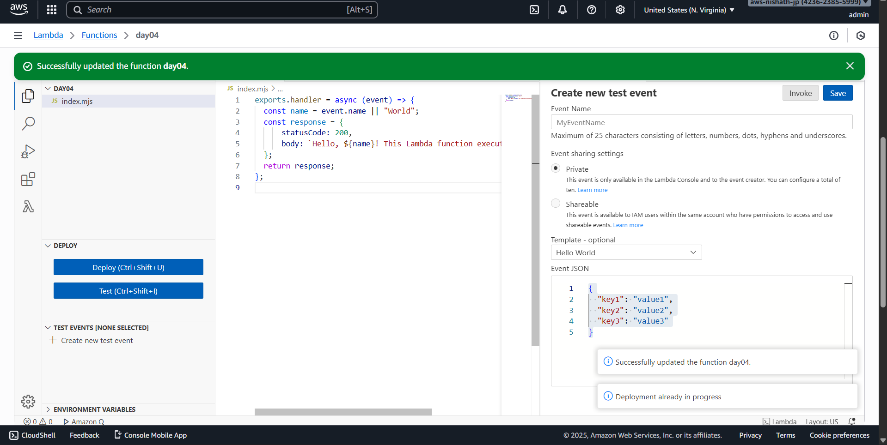
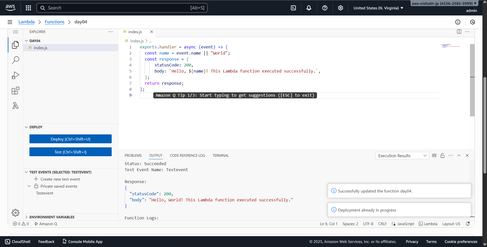

# Day 4 - Cloud Internship ElevateLabs

**☁ *Task 4: Deploy a Serverless Function to the Cloud**

---
 **🎯 Objective:**

To understand *serverless computing* by creating and deploying a simple *cloud function (FaaS)* that executes code automatically when triggered — without managing any servers.

This task helps interns learn *event-driven computing, **resource optimization, and **cost-effective deployments* in modern cloud environments.


- Created a Lambda function named day04

- Used Javascript code has excution code 
```JavaScript
exports.handler = async (event) => {
    const name = event.name || "World";
    const response = {
        statusCode: 200,
        body: `Hello, ${name}! This Lambda function executed successfully.`,
    };
    return response;
};
```
- And deployed the code.
- Created a New testing environment and tested the code to check if it is working properly.







