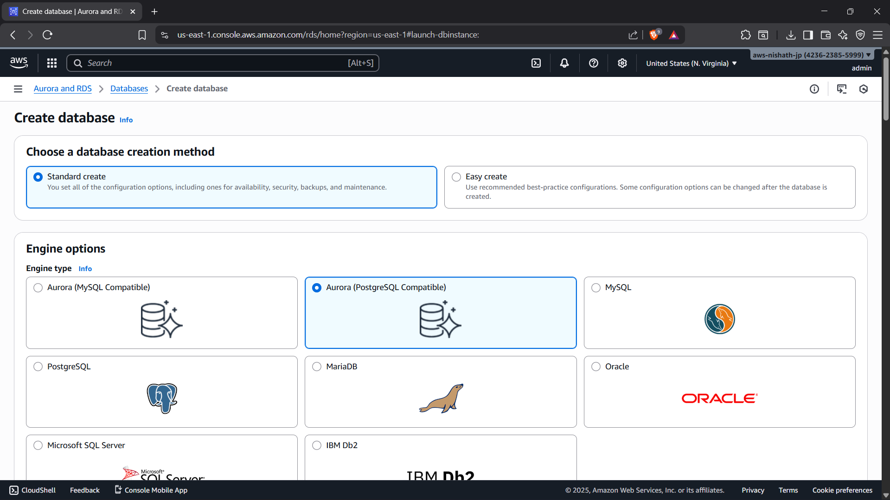
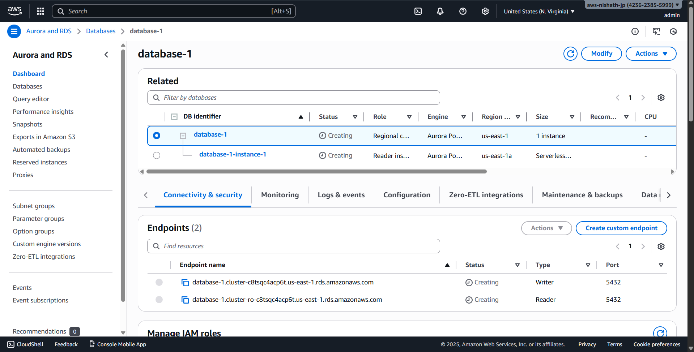

# Day 5 - Cloud Internship ElevateLabs

 **☁ *Task 5: Create and Connect to a Cloud Database Instance**

---
🎯 **Objective:**

To understand how *Cloud Databases* work by creating a *managed SQL database instance* (like MySQL or PostgreSQL) in the cloud, connecting to it, and performing basic operations.

This task helps you learn *database provisioning, connectivity, and CRUD operations* — all in a cloud-managed environment.

### Creating DB

### Successfuly Created 
