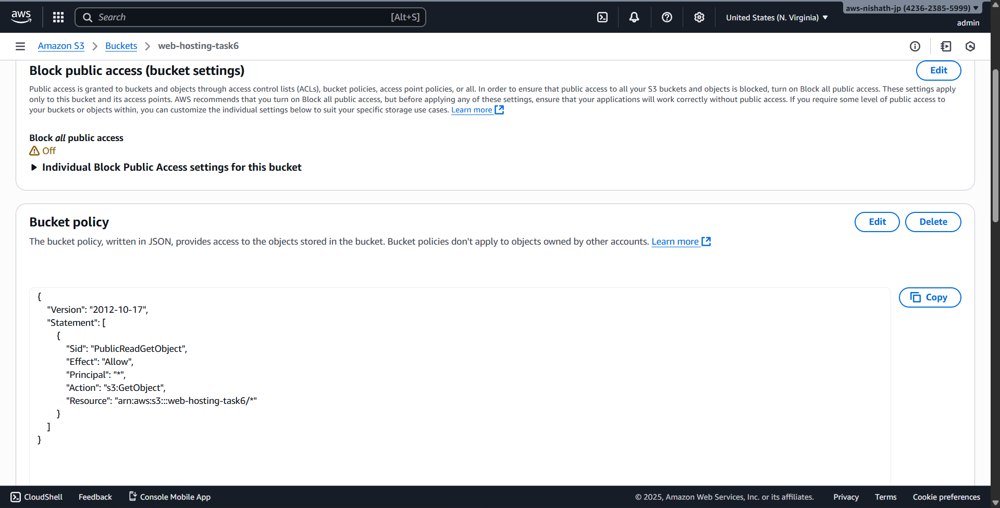
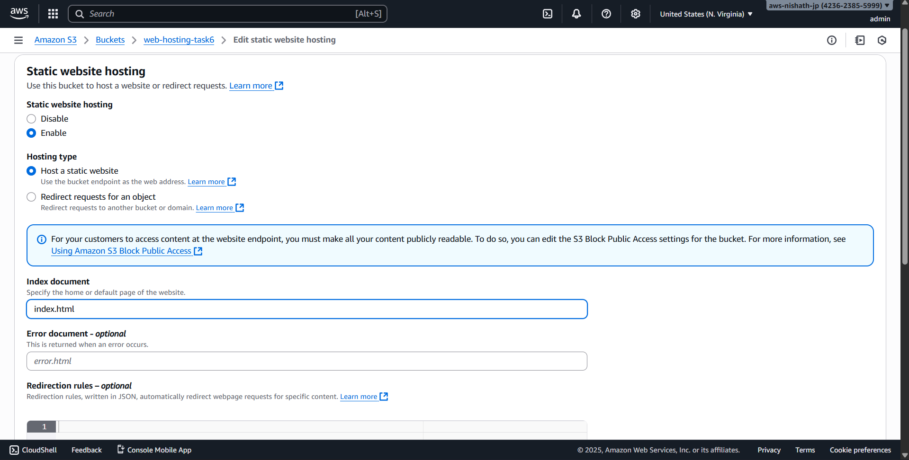
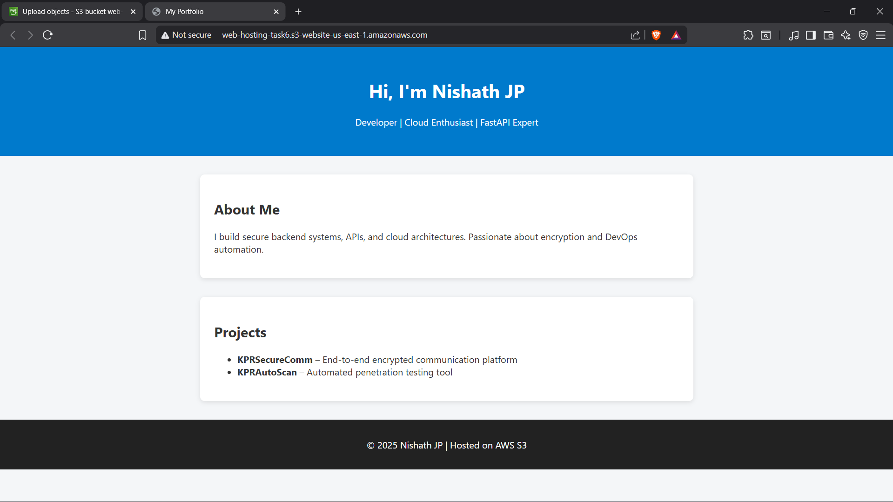

# Day 6 - Cloud Internship ElevateLabs

☁ **Task 6: Host and Deploy a Web Application on the Cloud**

---
🎯 **Objective:**

To deploy a *static or dynamic web application* (like a simple portfolio or basic HTML app) on a cloud platform using a *virtual machine, App Engine, or web hosting service*.

This helps interns understand *application deployment, public access, instance configuration, and domain management*.

.

## Images

### Created a new bucket

### Disabled Block all public access and added a bucket policy

### Enabled Static website hosting  

## Source Code
The source code for Day 6 can be found in the [Source code](Source%20code) directory.