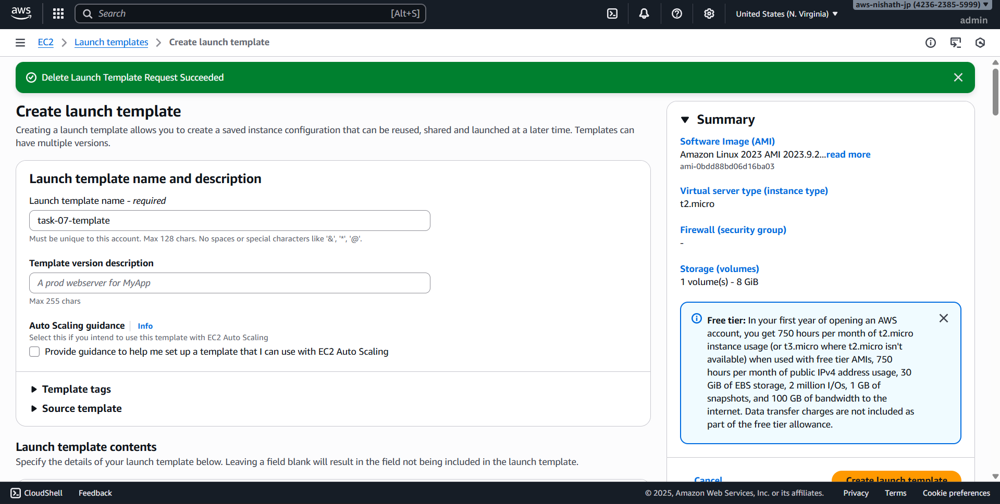
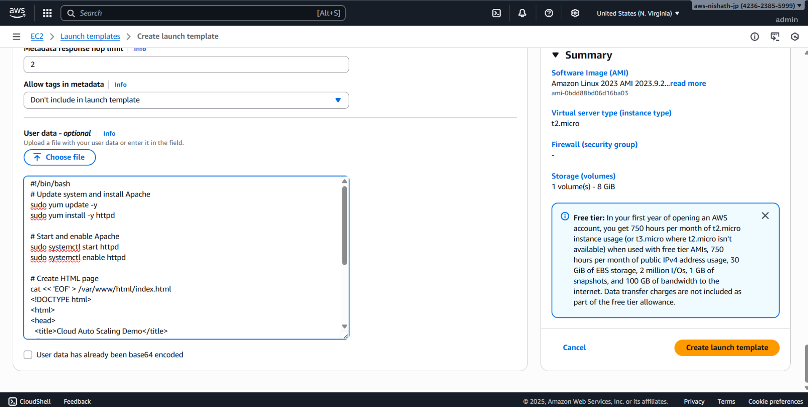
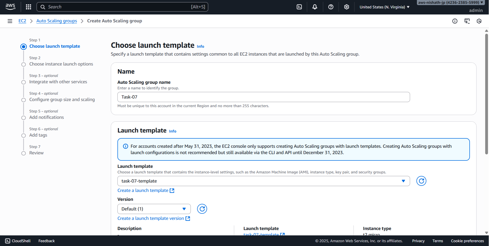
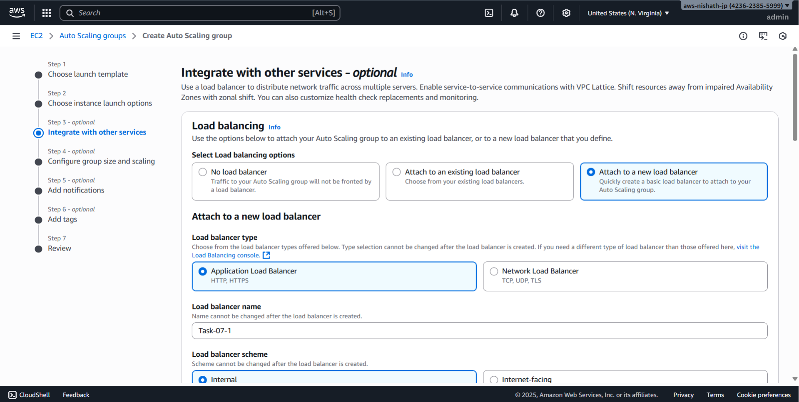
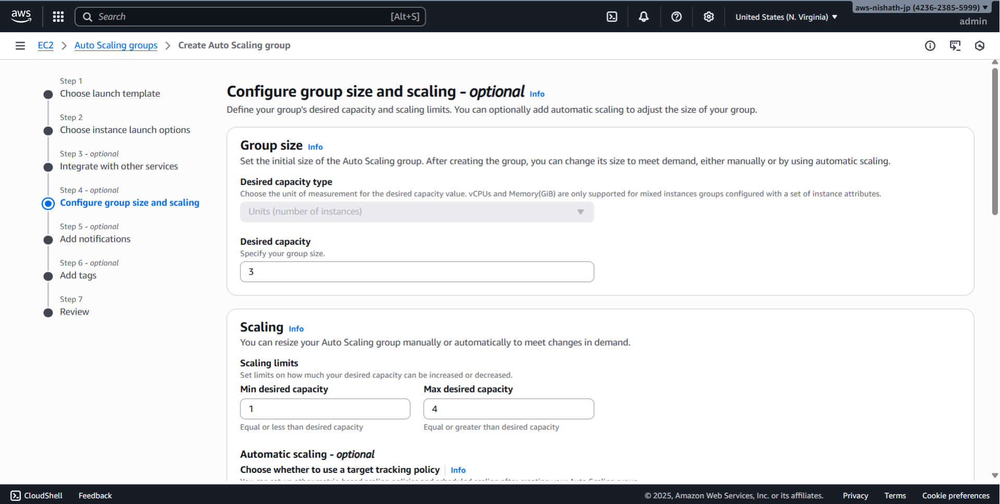
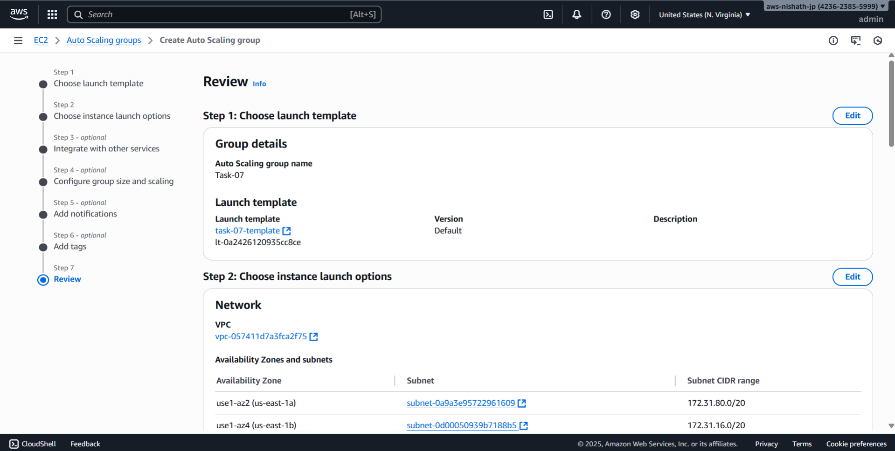
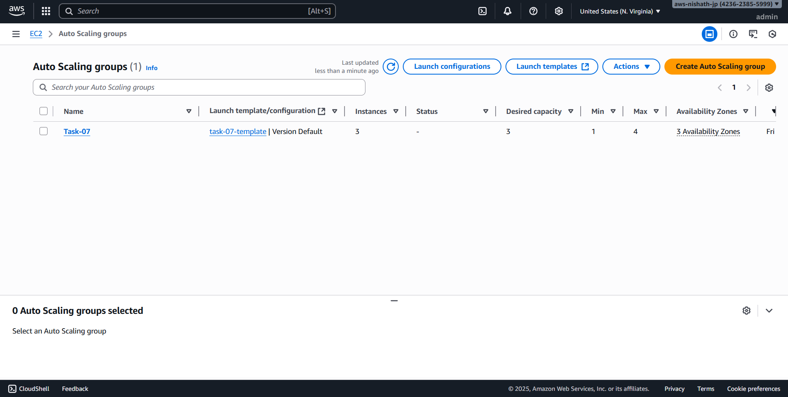
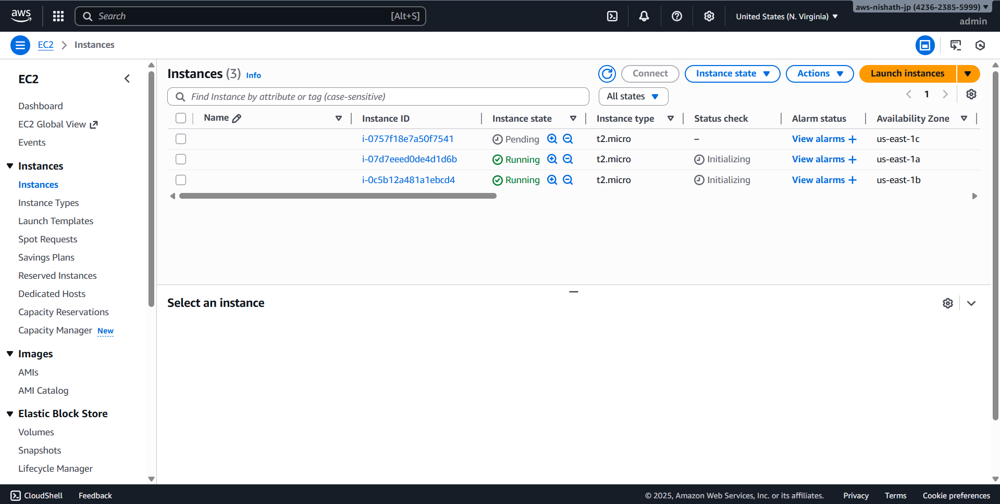
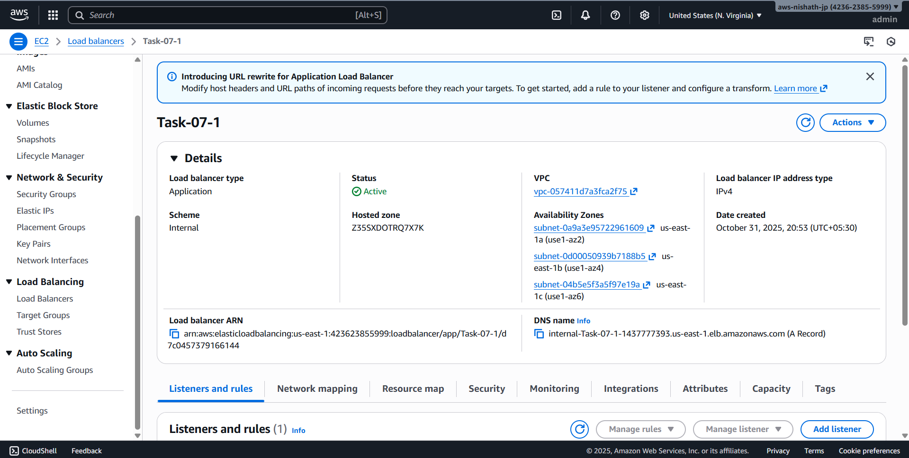

# Day 7 - Cloud Internship ElevateLabs

**☁ Task 7: Configure Load Balancing and Auto Scaling for a Web Application**

🎯 Objective:

To understand *scalability and fault tolerance* in cloud computing by setting up a *Load Balancer* and *Auto Scaling group* for a simple web application running on multiple virtual machines.

This helps interns learn how cloud systems handle high availability, traffic management, and cost-efficient scaling automatically.

- Created a Launch template and configured AutoScaling.
- With loadbalancer 
- attached a security group with http allowed

